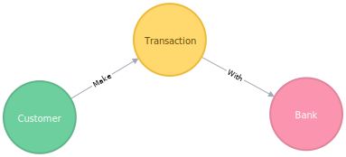

# Graph Enhanced Machine Learning For Fraud

This repository contains the code used to evaluate whether or not features created by running graph alogirthms on a standard dataset can be used to enhance supervised models predicting transactions to fraudulent or not. This was done as part of the Master's Thesis titled "_The Value of Graph Databases for Financial Fraud Detection and Prevention_".

## Getting Started 
This project consists of two main parts
1. Building a graph model using Neo4j
2. Creating supervised learning model and using features extracted for the graph to improve its accuracy  

## Data 

The simulated dataset used for testing the hypothesized model is simulated using BankSim, a financial fraud simulator developed by Lopez-Rojas (2016). The BankSim simulator produce a synthetic dataset with bank payment transactions, based on statistics and social network analysis of real data. It has been verified against the domain and validated statistically against the original source. The dataset is publicly available on Kaggle.com, which is a platform where statisticians and data miners can compete to produce the best predictive and descriptive models on datasets uploaded from corporations, academia, and regular users.

## Graph Model

A graph representation of the dataset is created to be able to run the graph algorithms, depicted in the figure below

To create this representation using the Neo4j Desktop, create a new database and make sure to install the GraphAlgorithm and APOC packages. 

When the packages has been installed, put a copy of the "bs140513_032310.csv" file in the database input folder by clicking "open folder" button in the Neo4j Desktop app. 

When the database is up and running, use the Neo4j Browser to execute the following query to import the data into Neo4j.
~~~~
CREATE CONSTRAINT ON (c:Customer) ASSERT c.id IS UNIQUE;
CREATE CONSTRAINT ON (b:Bank) ASSERT b.id IS UNIQUE;

USING PERIODIC COMMIT
LOAD CSV WITH HEADERS FROM
‘file:///bs140513_032310.csv’ AS line
WITH line,
SPLIT(line.customer, “‘”) AS customerID,
SPLIT(line.merchant, “‘”) AS merchantID,
SPLIT(line.age, “‘”) AS customerAge,
SPLIT(line.gender, “‘”) AS customerGender,
SPLIT(line.zipcodeOri, “‘”) AS customerZip,
SPLIT(line.zipMerchant, “‘”) AS merchantZip,
SPLIT(line.category, “’”) AS transCategory

MERGE (customer:Customer {id: customerID[1], age: customerAge[1], gender: customerGender[1], zipCode: customerZip[1]})

MERGE (bank:Bank {id: merchantID[1], zipCode: merchantZip[1]})

CREATE (transaction:Transaction {amount: line.amount, fraud: line.fraud, category: transCategory[1], step: line.step})-[:WITH]->(bank)
CREATE (customer)-[:MAKE]->(transaction)
;
~~~~

As the graph algorithms need a unipartite graph model to be able to run, a unipartite representation was created as depicted below.

This was done by first running the following query
~~~~
MATCH (c1:Customer)-[:MAKE]->(t1:Transaction)-[:WITH]->(b1:Bank)
WITH c1, b1
MERGE (p1:Placeholder {id: b1.id})
~~~~
Creating placeholder entities for the customers and merchants so all nodes have the same labels.  

Then the transaction relationships(here called "Payes") between the placeholder entities is created using the following query: 
~~~~
MATCH (c1:Customer)-[:MAKE]->(t1:Transaction)-[:WITH]->(b1:Bank)
WITH c1, b1, count(*) as cnt
MATCH (p1:Placeholder {id:c1.id})
WITH c1, b1, p1, cnt
MATCH (p2:Placeholder {id: b1.id})
WITH c1, b1, p1, p2, cnt
CREATE (p1)-[:Payes {cnt: cnt}]->(p2)
~~~~

Execute the following query to run the PageRank algorith on the placeholder enteties:
~~~~
CALL algo.pageRank('Placeholder', 'Payes', {writeProperty: 'pagerank'})
~~~~
Run this for community mining through label propagation: 
~~~~
CALL algo.labelPropagation('Placeholder', 'Payes', 'OUTGOING',
 {write:true, partitionProperty: "community", weightProperty: "count"})
~~~~
And lastly, the following for degree:
~~~~
MATCH (p:Placeholder)
SET p.degree = apoc.node.degree(p, 'Payes')
~~~~

## Jupyter Notebook 
Once the data has been modelled into a graph the data 
Open the banksim.ipynb using jupyter notebook to see code for creating the supervised learning models