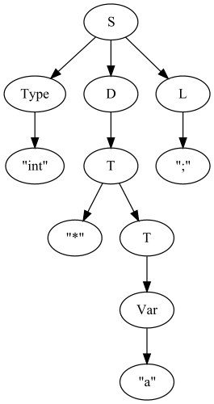

# КС-грамматика

<pre>
    S    ->  Type D L Next
    Next ->  S
    Next ->  eps
    L    ->  ; V
    V    ->  L
    V    ->  eps
    D    ->  T K
    K    ->  , D
    K    ->  eps
    T    ->  * T
    T    ->  Var B
    Var  -> 'NAME'
    Type -> 'NAME'
    Numb -> '[0-9]+'
    B    -> '[' Numb ']' B
    B    -> eps
</pre>

## First, Follow

| Нетерминал |    FIRST    |    FOLLOW    |
|:----------:|:-----------:|:------------:|
|     S      |   'NAME'    |      $       |
|    Next    | eps, 'NAME' |      $       |
|     L      |     ';'     |  'NAME', $   |
|     V      |  eps, ';'   |  'NAME', $   |
|     D      | 'NAME', '*' |     ';'      |
|     K      |  eps,  ','  |     ';'      |
|     T      | 'NAME', '*' |   ';', ','   |
|    Var     |   'NAME'    | '[',',', ';' |
|    Type    |   'NAME'    | 'NAME', '*', |
|    Numb    |  '[0-9]+'   |     ']'      |
|     B      |  eps, '['   |   ',', ';'   |

## Meaning
| Нетерминал |                                 Описание                                 |
|:----------:|:------------------------------------------------------------------------:|
|     S      |                 Одно или несколько обьявлений переменных                 |
|    Next    |            Несколько обьявлений переменных(может быть пустым)            |
|     L      |                    Одна или несколько точек с запятой                    |
|     V      |               Несколько точек с запятой(может быть пустым)               |
|     D      | Одно имя переменной и возможно продолжение ряда переменных через запятую |
|     K      |                Продолжение ряда переменных через запятую                 |
|     T      |            Несколько звездочек(может быть 0) и имя переменной            |
|    Var     |                              Имя переменной                              |
|    Type    |                                 Имя типа                                 |

## Example

